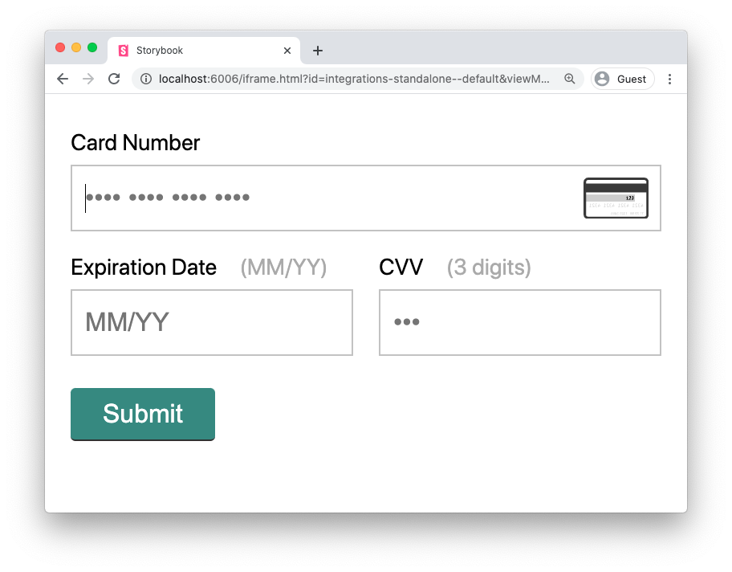

# Gr4vy Embed


Quickly embed a credit card form in your web app and store the card details, authorize the card, and capture a transaction.



Visit [Gr4vy.com](https://gr4vy.com) for more details.

## Usage

Via the command line, install this package as follows.

```bash
npm install @gr4vy/embed --save-prod
# yarn add @gr4vy/embed --save
```

## Get started

This project provides a few different ways to integrate.

### CDN

The easiest way is to install via your cluster's CDN. Simply inject the script at the top
of your page.

```html
<script src="https://cdn.acme.cluster.gr4vy.com/gr4vy-embed-vX.X.X.js"></script>
```

Then, assuming your page has a form and a container to attach the form to, call the
`gr4vy.setup` function and attach the form to the container element, as well as specify
the form to attach any new values to.

```html
<form action="/submit" className="form">
  <div id="container"></div>
  <input type="submit" value="Submit" />
</form>
<script>
  gr4vy.setup({
    element: '#container',
    form: '.form',
    options: {
      flow: ['authorize', 'capture', 'store'],
      amount: 1299,
      currency: 'USD',
      frameHost: '127.0.0.1:8080',
      apiHost: '127.0.0.1:3100',
      bearerToken: 'JWT_TOKEN',
      showButton: true,
      debug: 'debug',
      externalIdentifier: 'user-1234',
    },
  })
</script>
```

When the form is submitted, the embedded Gr4vy form will submit the payment details and
insert two new hidden input fields in the form. Your application can use these details
on the server to query for more information about the status of it.

| Hidden field          | Description                                                                                                                                                     |
| --------------------- | --------------------------------------------------------------------------------------------------------------------------------------------------------------- |
| `gr4vy_resource_type` | The type of the resource that was created by the embedded form. This is currently either a `card` or a `transactions.authorization`.                            |
| `gr4vy_resource_id`   | The ID of the resource that was created by the embedded form. This can be used by the server-side SDK to query for more information about the created resource. |

### Node

If you are using Node you can import Gr4vy rather than using a script tag.

```js
const gr4vy = require(`@gr4vy/embed/cjs`)
// or using CSS modules
import gr4vy from (`@gr4vy/embed/cjs`)

gr4vy.setup({...})
```

### React

This project also comes with 2 integrations for React. Both versions do not come with `react` or
`react-dom` bundled, but the UMD version comes with all the assets bundled into one JS file.

```js
// A version that requires you to bring your own Babel, and more. See below.
import Gr4vy from '@gr4vy/embed/react'
// A version with all assets bundled into 1 JS file
import Gr4vy from '@gr4vy/embed/react-umd'
```

> Using the ESM components requires a few additional dependencies to compile SASS, CSS modules, and JSX. Please see the `/example` folder for a minimal example of a project using Webpack and Babel.

The component can be used as any regular React component and accepts the same options as
the regular CDN / Node integration.

```js
import React from 'react'
import ReactDOM from 'react-dom'

import Gr4vy from '@gr4vy/embed'

ReactDOM.render(
  <Gr4vy
    flow={['authorize', 'capture', 'store']}
    amount={1299}
    currency={'USD'}
    frameHost="127.0.0.1:8080"
    apiHost="127.0.0.1:3100"
    bearerToken="JWT_TOKEN"
    showButton
    debug="debug"
  />,
  document.getElementById(`app`)
)
```

### Element & Form

When using the CDN/Node version of this library it needs to be provided
two HTML elements to attach itself to. The values for these elements are
a query string that can be parsed by `document.querySelector`. For example,
`<div class="container" />` would be represented as `.container`, while
`<form id="cardform">` would be represented by `#cardform`.

| HTML Element | Example      | Description                                                                                                                                                                                      |
| ------------ | ------------ | ------------------------------------------------------------------------------------------------------------------------------------------------------------------------------------------------ |
| `element`    | `.container` | Specifies the HTML element to attach the form to. Gr4vy Embed will insert the form at this location.                                                                                             |
| `form`       | `#cardform`  | Specifies the HTML Form to attach additional inputs to. Gr4vy will automatically insert hidden Input fields into this form containing the created resource (often an authorization) ID and type. |

### Options

The options for this integration are as follows.

| Field                | Default                     | Description                                                                                                                                                                                                                                                          |
| -------------------- | --------------------------- | -------------------------------------------------------------------------------------------------------------------------------------------------------------------------------------------------------------------------------------------------------------------- |
| `amount`             | `null`                      | The amount to authorize or capture in the specified `currency`. Not required if the `flow` is set to `store` only.                                                                                                                                                   |
| `apiHost`            | `null`                      | **Required** - The host (both hostname and port) of the Gr4vy API server to use.                                                                                                                                                                                     |
| `bearerToken`        | `null`                      | **Required** - The server-side generated JWT token used to authenticate any of the API calls.                                                                                                                                                                        |
| `currency`           | `null`                      | A valid, active, 3-character `ISO 4217` currency code to authorize or capture the `amount` for.                                                                                                                                                                      |
| `flow`               | `authorize, capture, store` | Controls the behaviour of the integration, defining if it should perform an authorization, as well as a capture, and if the card should be stored. Both `authorize` and `store` could be performed without the others. `capture` requires `authorize` to be present. |
| `frameHost`          | `null`                      | **Required** - The host (both hostname and port) of the server that hosts the Gr4vy payment form.                                                                                                                                                                    |
| `showButton`         | `false`                     | Setting this value to `true` will show a **Submit** button within the UI. This is useful when the UI around this element does not contain a button                                                                                                                   |
| `onEvent`            | `null`                      | An optional event handler to bind to the form. This is called for various events, more on that below.                                                                                                                                                                |
| `timeout`            | `10000`                     | The optional timeout to wait for the embedded form to load before it throws a `timeoutError` to the `onEvent` handler.                                                                                                                                               |
| `externalIdentifier` | `null`                      | An optional external identifier that can be supplied. This will automatically be associated to any resource created by Gr4vy and can subsequently be used to find a resource by that ID                                                                              |

### Events

The `onEvent` option can be used to listen to certain events emitted from the form.

```js
gr4vy.setup({
  element: '#form',
  options: {
    flow: ['authorize', 'capture', 'store'],
    ...,
    onEvent: (name, data) => {
      ...
    }
  }
})
```

Currently, we emit the following events.

#### `agumentError`

Returned when the initial input (`element`, `options`) are incorrectly formatted or missing.

```json
{
  "code": "argumentError",
  "option": "options.currency",
  "message": "must be a valid number"
}
```

#### `formUpdate`

Returned when the form updates.

```json
{
  "valid": false
}
```

#### `resourceCreated`

Returned when an authorization or card was successfully created. This ID in this object can be used
to query the resource server-side, to check on the status of the object.

```json
{
  "type": "status",
  "status": "pending",
  "resource_type": "transactions.authorization",
  "resource_id": "8724fd24-5489-4a5d-90fd-0604df7d3b83",
  "external_identifier": "user-1234"
}
```

#### `timeoutError`

Returned when the embedded form could not be loaded within the set timeout.

```json
{
  "message": "Embedded form timed out"
}
```

#### `apiError`

Returned when the form encounters an API error.

```json
{
  "type": "error",
  "code": "unauthorized",
  "status": 401,
  "message": "No valid API authentication found",
  "documentation_url": "https://developer.gr4vy.com/errors/unauthorized",
  "additional_context": null
}
```

## Library size

We've worked hard to keep this library as small as possible. Depending on your implementation, you can expect the following estimated dependency sizes.

| Format                                              | Size   | Compressed |
| --------------------------------------------------- | ------ | ---------- |
| React Component                                     | `52K`  | `8K`       |
| React Component, bundled without `peerDependencies` | `20K`  | `8K`       |
| CommonJS library                                    | `148K` | `48K`      |
| CDN version                                         | `148K` | `48K`      |

## Development

To get started with this project, follow these steps.

### Preparation

To get started, clone the project and install the required dependencies. This
project relies on the `yarn` package manager.

```sh
git clone git@github.com:gr4vy/embed.git
cd embed
# npm i -g yarn
yarn install
```

### Development Server & Storybook

To run the local development server, tests, and storybook, you can simply run the following command.

```sh
yarn dev
```

This will open a development preview on http://localhost:8081/ and the Storybook UI on http://localhost:6007/.

You could also run these commands individually as follows.

```sh
yarn start
yarn test!
yarn storybook
```

> **Note:** By default `yarn start` will open on http://localhost:8081/ yet you will only see a spinner. The reason for this is that this page expect the iframe to be loaded on the `frameHost` domain and is waiting for a cross-frame message to initialize the UI. Use this page in combination with the `embedded-components` package to spin up an iframe instance.

### Local testing and linting

Tests and linting are provided by a mix of `jest`, `storybook` and `eslint`. Storybook is used to check if the UI has changes since it last recorded a snapshot.

```sh
yarn test
yarn lint
```

To update snapshots (after you've validated that the changes are desirable) you can run `yarn test -u`. To run tests continuously and watch for changes, the `yarn test!` command is available.

> **Note:** We try to keep a coverage of a 100%. Run the `yarn test!` command to see more details on our current coverage level. Missed lines can be explored by opening the `coverage/index.html` file after a test has been run.

### CI/CD & Publishing

We use GitHub Actions to automatically test and lint our code, as well as control the publishing of new versions
of the package.

To publish a new version, simply run:

```sh
yarn release
```

This command will ask for a new version number, update the `package.json`, and then push a new tag for
that version. GitHub Actions then picks up the new tag and publishes it as a new package to GitHub's
pacakage registry.

### Project layout

This projects folder structure is as follows.

```yaml
- .github/
  - workflows/ # GitHub actions for CI/CD
- .storybook/ # Configuration for Storybook
- docs/ # Additional documentation resources
- src/
  - index.js # The React entry point for this library
  - dev.js # The entry point for the dev server
  - components/
    - Frame/ # All the UI for the wrapper that loads the iFrame
      - index.js # The controler for the Frame, this controls behaviour and not what is displayed
      - View.js # The view for the Frame, this controls what is displayed, and not the behaviour
      - functions.js # A list of helper functions used by the controller
      - style.css # Styling for the UI, mostly to style to loader
      - loaders.svg # An animated SVG loader, shown while the page loads
      - Emitter/ # A helper class used to communicate with the parent frame
      - Logger # A helper class used to output debug statements to the console
  - umd/ # The UMD entry point for the CDN / Node integration which bundles React and uses a setup method
- stories/ # Storybook stories
- tests/ # Tests, test configuration, and snapshots
- webpack/ # Configuration for Webpack, the tool used to transpile the source into a single file
```

## License

This project is provided as-is under the [MIT license](LICENSE).
